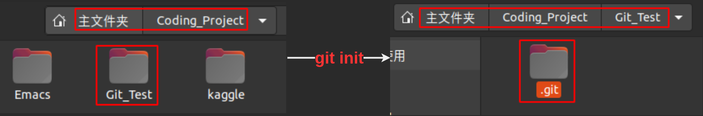
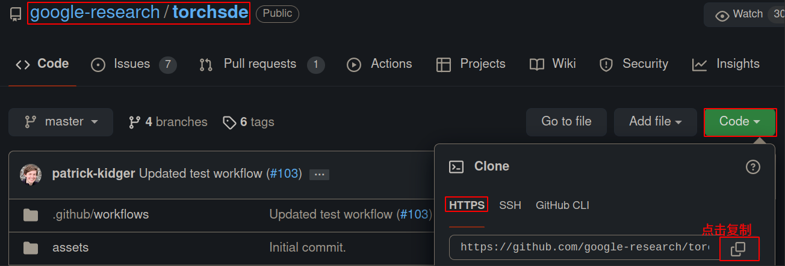

# 二、Git基础

本章涵盖了使用Git完成各种工作所用到的各种基本命令，通过这里的学习我们可以完成以下任务：
- （1）配置并初始化一个仓库（repository）；
- （2）开始或停止跟踪（track）文件；
- （3）暂存（stage）或提交（commit）更改。

另外，本章进一步介绍了：
- （1）配置Git忽略指定的文件和文件模式；
- （2）撤销错误操作；
- （3）浏览项目历史版本以及不同提交（commits）之间的差异；
- （4）向远程仓库推送（push）以及从远程仓库拉取（pull）文件。

## 2.1 获取Git仓库
获取Git仓库通常使用如下两种方式：
- 1、使用`git init`命令，将还没有进行版本控制的本文目录初始化为Git仓库；
- 2、使用`git clone`命令，从其他服务器克隆Git仓库。

**初始化本地项目**

比如，在任意目录下创建一个`Git_Test`文件夹，在该文件夹下打开终端，输入`git init`。该命令会在该文件夹下创建一个`.git`子目录包含了构建Git仓库的所有必要骨干文件。此时，只是初始化了一个Git仓库，并没有对项目中的文件进行跟踪。

<div align=center></div>

如果想实现对该项目进行版本控制还需要：
- （1）使用`git add`对项目中文件进行跟踪；
- （2）使用`git commit`将项目提交到本地库。

**克隆现有仓库**

使用`git clone`命令，可以从其他服务器（比如Github）上克隆已经存在的Git仓库。作为Git的一个重要特性，`git clone`命令是克隆了服务器上已经存在的仓库的所有数据，默认配置会将目标Git仓库中的每个文件的每一个版本都拉取到本地。

比如，我们想要从Github上克隆一个项目` google-research/torchsde`，首先需要找到项目的克隆地址，获取方式如下图所示：

<div align=center></div>


然后，新建一个`Git_Clone_Test`项目，在该文件夹下开打终端，输入`git clone https://github.com/google-research/torchsde.git`，就完成了现有仓库的克隆。

另外，如果想要自定义克隆仓库的名字，可以使用如下命令，下载的仓库名字就设置为`My_Lib`了：

```bash
git clone https://github.com/google-research/torchsde.git My_Lib
```

Git支持多种数据传输协议，上面的例子是基于`https://`协议，还可以使用`git://`协议或者`SSH`传输协议。


