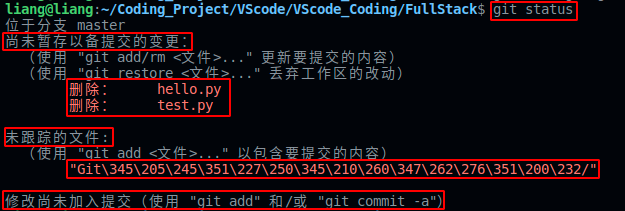
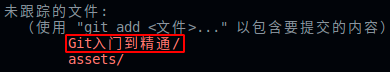

# 一、Git初始化本地库

基本语法：

```
git init
```

在项目路径下的终端中输入上述命令，就会在该目录下生成一个`.git`文件，这样本地仓库就初始化成功了，这样git就获得了该文件夹的版本控制权了，也就是说我们可以使用git相关命令对项目进行版本控制了。


# 二、Git查看本地库状态

基本语法：
```
git status
```

由于我在该项目下新创建了一个文件`Git入门到精通`，并且删除了两个文件，所示使用`git status`命令后，输入如下所示的结果：

<div align=center></div>

由上图可以看出，当前项目处于`master`主分支上，另外还包括三部分内容：
- （1）尚未暂存一备提交的变更：这里记录了删除的两个文件的项目文件变动信息；
- （2）未跟踪的文件：记录了新创建的`Git入门到精通文件`及其文件夹中的文件的信息。
- （3）修改尚未加入提交：表明目前的操作只是在工作区的操作，需要执行`git add`和`git commit`命令才能将项目添加本地仓库中，以便进行版本控制。

需要注意的是未跟踪文件显示为一串八进制数字，而不是中文，可以通过下面命令进行排错：

```
git config --global core.quotepath false
```

<div align=center></div>

# 三、Git提交本地仓库区操作

如果想将项目提交到本地仓库区，需要使用两条命令将工作区的代码添加到暂存区和仓库区，这样就实现了代码的版本控制。

## 3.1 添加到暂存区

命令格式
```
git add 文件名
```

`git add .`可以实现将项目文件夹下所有文件添加到暂存区，执行此指令，本地库状态则变为如下图所示的结果：

<div align=center></div>

这样，第二部分工作区的操作就全部添加到暂存区了，包括删除文件操作信息。

## 3.2 提交到本地库

提交到暂存区并没有形成历史版本，需要提交到本地库后才可以形成历史版本了。

命令格式：

```
git commit -m "备注"
```


