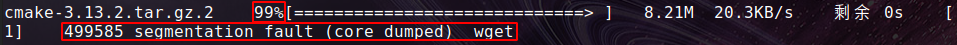
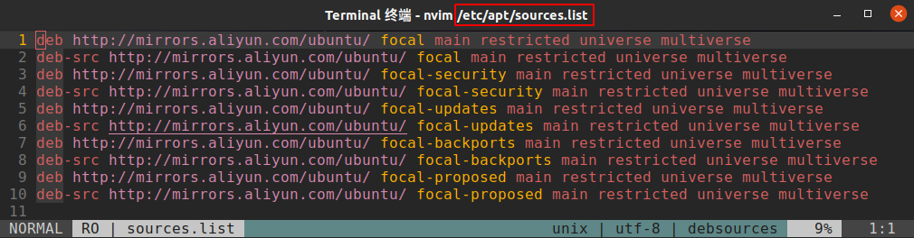
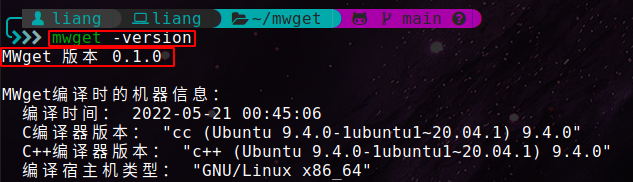
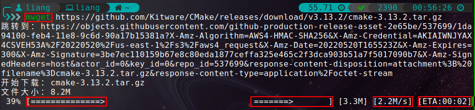
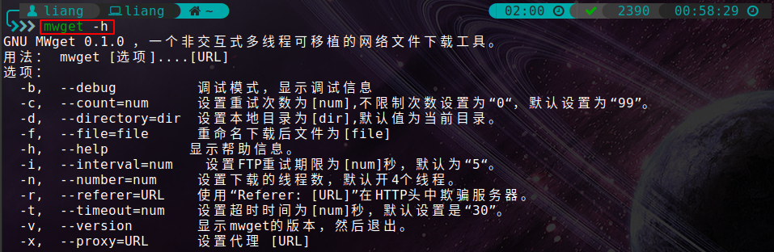

@[TOC](ubuntu资源下载利器：多线程、断点续传下载工具mwget的安装与使用)
# :orange_book: 实际问题：资源下载很慢

*:sparkles: 我们在使用`wget`下载网络上的资源时，经常遇到几k的下载速度。然而，我们已经设置国内源了，但是仍然无济于事。如下图所示，8M多的资源下了将近二十分钟。*


如下下图所示，甚至更过分的是，有的时候终于等了小半个小时，下载到99%，然后`wget`下载终止了，然后还要重新下载。



我这里已经设置了国内阿里源了，在终端输入`vim /etc/apt/sources.list`就可以查看系统下载源配置信息了：



*:dizzy: <font color="red"> 问题解决：</font> 在不使用科学手段的前提下，我在网上查到到了一个非常好的替代方法：使用<font color="red">mwget</font>，它是一个多线程、断点续传下载工具，其中的`m`就是`multi`多线程的意思。*

# :orange_book: mwget的安装与使用


## :book: mwget的安装

```bash
git clone https://github.com/rayylee/mwget.git
cd wget
./configure
sudo make
sudo make install
```

在终端输入`mwget -ersion`出现如下图所示信息，则表示安装成功：




## :book: mwget的使用


这个时候我怎么再重新下载一下文章开头的cmake-3.13.2.tar.gz：

```bash
mwget https://github.com/Kitware/CMake/releases/download/v3.13.2/cmake-3.13.2.tar.gz
```



由上图可以看出，下载速度`2.2M/s`，下载时间由原来一二十分钟变为几秒钟，且可以看出下载进度条有两条，说明`mwget`确实是多线程下载工具。

另外，如果想查看更多有关`mwget`方的详细使用方法，可以再终端输入`mwget -h`来查看：



> **注意：**
> :memo: mwget功能相对于wget的功能比较少，但是对于个人计算机甚至小型服务器运维人员来说，mwget的功能能够满足大部分需求。
