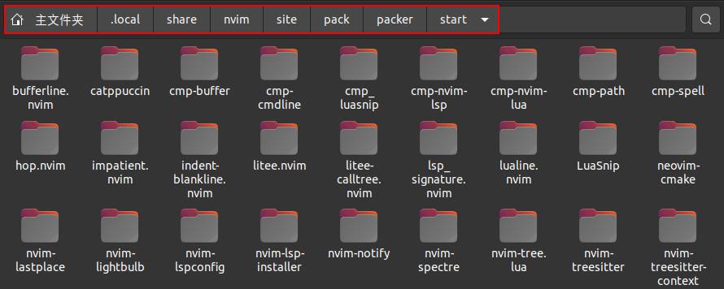

## Packer简介

与Vim不同，Neovim是使用`lua`原生的[packer.nvim](https://github.com/wbthomason/packer.nvim)进行插件管理的。如果英语水平好的话，建议多看看`packer.nvim`给出的帮助手册，可以通过在NVIM中输入`:h packages`查看其说明手册。


## Pakcer.vim插件管理器的安装

untuntu系统的安装方法如下所示：

```
git clone --depth 1 https://github.com/wbthomason/packer.nvim\
 ~/.local/share/nvim/site/pack/packer/start/packer.nvim
```

由上面的命令可以看出，
克隆的`Packer.vim`插件的目录在`~/.local/share/nvim/site/pack/packer/start/packer.nvim`目录中，以后我们使用的`packer.nvim`插件管理工具安装的插件都安装在该目录下。

<div align=center></div>

