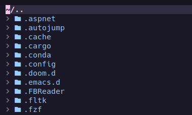
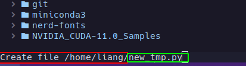
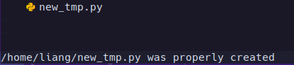
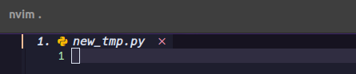
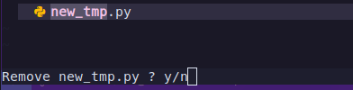

文章声明：
我这里使用的配置是基于一个大神写好的，并发布到Github上，网址为：https://github.com/ravenxrz/dotfiles/tree/master/nvim，通过学习他的配置达到入门NVIM。
他还在B站上发布了一个配套教学视频，他的个人B站网址：https://space.bilibili.com/26319956/video。
这里只是学习使用，如有侵权，联系必删。
个人邮箱：liangxiaobei2016@163.com

## 一、NVIM用户界面（UI）配置

### 1.1 目录导航
进入一个目录，并在该目录下打开终端，输入`nvim .`在NVIM中打开了该文件目录导航。比如，在根目录下输入`nvim .`，就出现如下图所示的目录导航：

### 1.2 新建文件
在上面打开的目录导航中按下`a`后，在NVIM的左下角就会打开该文件夹的目录地址(如下图红框中所示)，然后输入想要创建的文件`new_tmp.py`（如绿框中所示）：

创建完成后，如下图所示，在目录导航中就出现了新建的文件`new_tmp.py`，并在NVIM的右边打开该文件等待编辑：

### 1.3 重命名文件

### 1.4 删除文件

如下图所示，选中想要删除的文件按下`d`，然后再按下`y`，就完成了文件删除：

