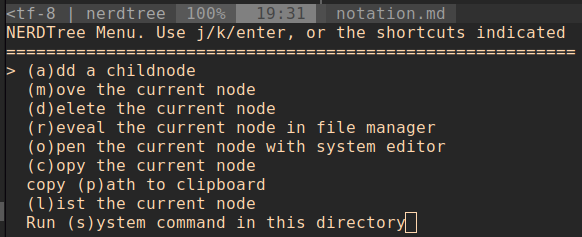

# VIM插件：目录导航与操作插件NERDTree的使用方法


## 📘 从外部Buffer打开NERDTree的方法

👨‍💻 *假设已经会了VIM的配置基本知识，并会安装和简单配置VIM插件了，如果这点不太熟悉，可以自行查看相关文献。*

NERDTree没有设置从外部Buufer打开的快捷方式，但是我们可以在自己的vim配置文件中使用`nnoremap`进行快捷键绑定，官网给出了一个配置方法：

```bash
nnoremap <leader>n :NERDTreeFocus<CR>
nnoremap <C-n>     :NERDTree<CR>
nnoremap <C-t>     :NERDTreeToggle<CR>
nnoremap <C-f>     :NERDTreeFind<CR>
```

其实，官方给出的快捷键配置方案并不是最佳的，为了避免与现有的快捷键冲突，我这里将它们的快捷键都与`<leader>`键进行绑定：


```bash
" 将leader键设置为,
let mapleader=','
let g:mapleader=','

nnoremap <leader>n :NERDTreeFocus<CR>
nnoremap <leader>m :NERDTree<CR>
nnoremap <leader>t :NERDTreeToggle<CR>
nnoremap <leader>f :NERDTreeFind<CR>
```

这样我们就可以在编辑界面中通过如下快捷键打开NERDTree：

| 快捷键 | 描述 |
|:--|:--|
| `,+n` | 打开当前文件NERDTree目录树，光标停留在上次光标停留的位置 |
| `,+m` | 打开当前文件NERDTree目录树，光标停留在当前文件路径的根目录上，并将文件夹折叠起来 |
| `,+t` | 打开/关闭NERDTree目录树 |
| `,+f` | 查找当前文件在NERDTree中的位置，并将光标停留在NERDTree中该文件上 |

- 💫 这里需要注意`NERDTree`、`NERDTreeFocus`和`NERDTreeFind`之间的区别。


## 📘 NERDTree目录导航

📝 在NERDTree中我们可以使用`k/j`上下移动键在文件/文件夹之间移动，但是当项目文件/文件夹很多时候，这种方式就显得很笨拙了。NERDTree提供了如下表所示的快捷移动方式；
📝 NERDTree的目录导航分为*项目级别导航*和*系统级别导航*，下面分别介绍。

✨ <font color="red">注意：</font>下面的NERDTree目录导航的对象只是<font color="red">文件夹</font>。

## 📖 项目级别NERDTree目录导航

| 快捷键 | 描述 |
|:--|:--|
| `P` | 移动到本项目的根目录文件夹处 |
| `p` | 移动文件/文件夹所属的子文件夹处 |
| `K` | 移动到本项目的第一个文件夹处 |
| `J` | 移动到本项目的最后一个文件处 |
| `Ctrl-j` | 移动下一个文夹处 |
| `Ctrl-k` | 移动上一个文夹处 |
| `o` | 打开折叠的文件夹，但是不打开子折叠文件夹 |
| `O` | 打开折叠的文件夹，同时打开子折叠文件夹 |
| `x` | 折叠起来打开的文件夹，但是不折叠打开的子文件夹 |
| `X` | 折叠起来打开的文件夹，同时折叠打开的子文件夹 |
| `e` | 在编辑器区打开当前文件夹的目录，用于详细阅读该文件夹内容 |


### 📖 系统级别NERDTree目录导航

| 快捷键 | 描述 |
|:--|:--|
| `C` | 将当前文件夹变为根目录 |
| `U`/`u` | 将当前文件夹的上一级目录作为根目录 |
| `r` | 刷新光标所在的文件夹 |
| `R` | 刷新当前根目录所有文件夹 |


## 📘 NERDTree中文件/文件夹操作

📝 NERDTree的文件/文件夹操作主要包括：（1）文件的打开方式；（2）对文件/文件夹的增、删、查、改操作。

✨ <font color="red">注意：</font>下面的NERDTree目录导航对象是文件或文件。


### :book: NERDTree中文件的打开方式


| 快捷键 | 描述 |
|:--|:--|
| `o` | 直接在编辑区以替代的方式打开文件 |
| `i` | 将编辑区横向切分窗口，并在新的窗口中打开文件 |
| `s` | 将编辑区纵向切分窗口，并在新的窗口中打开文件 |


### :book: NERDTree中对文件/文件夹的增、删、查、改操作


打开NERDTree目录操作界面的方法为：将光标停靠在目录树中任意位置，按下快捷键`m`就弹出如下图所示的NERDTree目录树操作界面：



由上图可以看出，对目录树中文件/文件夹可进行的操作包括如下表所示的内容：

| 快捷键 | 目录树操作 |
|:--|:--|
| `a` | 在当前文件夹下新建一个文件/文件夹，只有自定义名字则创建文件，而在自定义名字后面加上`/`则创建文件；:bookmark:助记：`a`$\to$`(a)dd` |
| `m` | 修改文件/文件夹的名字；:bookmark:`m`$\to$`(m)ove`，在Linux系统的`move`一个文件到自己的位置，就是修改文件/文件夹名字的操作。 |
| `d` | 删除文件/文件夹；:bookmark:`d`$\to$`(d)elete` |
| `r` | 在文件管理器中展示当前文件/文件夹；:bookmark:`r`$\to$`(r)eveal` |
| `o` | 使用系统默认编辑器打开当前文件/文件夹，如果是文件则使用文件管理器打开；:bookmark:`o`$\to$`(o)pen` |
| `c` | 复制当前的文件/文件夹，<font color="red">注意：</font>复制完成后，需要选择需要粘贴的位置；:bookmark:`c`$\to$`(c)opy` |
| `p` | 复制当前文件/文件夹的路径到剪切板:bookmark:`p`$\to$`(p)ath` |
| `l` | 列出当前文件/文件夹信息:bookmark:`l`$\to$`(l)ist` |


