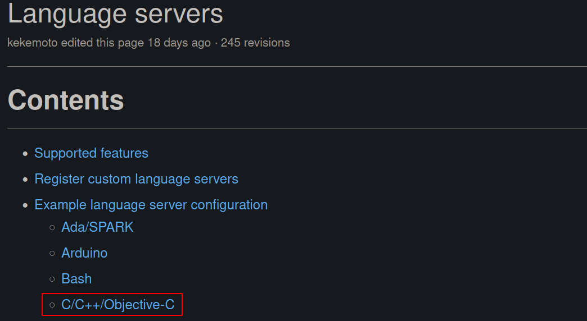

@[TOC](Coc.nvim中语言服务子插件的安装与管理介绍（避坑点）)


coc.nvim的下载地址：🔗https://github.com/neoclide/coc.nvim.git。


# :blue_book: Coc.nvim插件及语言服务子插件的安装


## :book:Coc.nvim插件与语言服务子插件的关系
 
它是一款适用于Neovim、Vim8的智能补全插件，并且用于完整的LSP（Language Server Protocol）支持。Coc.nvim是基于Node.js的，所以系统中必须提前安装Node.js。

Coc.nvim是Vim的一个插件，同时它还是一个为各种编程语言提供自动补全功能的平台，coc.nvim本身还具有针对不同语言提供自动补全功能的子插件。


<div align=center></div>

下一小节给出了coc.nvim的安装方法及相关语言支持插件的安装方法；另外，后面的附录给出了，常用的coc.nvim语言自动补全插件安装指令。


## :book: 安装前准备


在安装coc.nvim
- 我使用的是Ubuntu系统，NVIM插件使用的是`vim-plug`，它是一个非常好用的Vim插件管理工具，具体的可以参考[🔗这里](https://github.com/junegunn/vim-plug)，如果感觉查看官方英文使用方法时感觉不方便，可以参考这个视频：[🔗Vim安装插件，竟如此简单](https://www.imooc.com/video/19462)。
- 在安装Coc.nvim之前，需要首先安装Node.js和Yarn。关于对Node.js和Yarn的简介及安装过程可以参考[🔗npm、node.js、yarn简介](https://blog.csdn.net/weixin_37926734/article/details/124835604?spm=1001.2014.3001.5501)。<font color="red">注意：</font>的是需要修改npm的镜像源，不然在安装编程语言支持插件时候会出现链接补上仓库的问题。


> <font color="red">注意：</font>
> :memo: Node.js的版本需要>=12.12。
> :memo: 需要将npm设置为淘宝npm镜像，否则在安装coc.nvim支持的语言插件时候会下载不了，具体的设置方法如下所示：

关于npm仓库源的查询与切换指令：

```javascript
//npm仓库源查询指令
npm config get register
//npm仓库换源指令
npm config set register https://registry.npm.taobao.org
```

## :book: Coc.nvim安装


对于`vim-plug`插件管理工具，coc.nvim安装方法为在`vim-plug`插件安装代码（其具体操作可以参考[Vim安装插件，竟如此简单](https://www.imooc.com/video/19462)）下面添加如下代码：

```vimscript
Plug 'neoclide/coc.nvim', {'branch': 'release'}
```

然后重启vim，在命令行输入`PlugInstall`，等待下载完成就可以完成代码补全插件coc.nvim了。

> 💫 Coc.nvim的安装非常简单，最主要的是要对coc.nvim的工作原理，只有理解了原理，才能顺利的安装下面的coc.nvim语言补全插件。

## :book: Coc.nvim语言服务子插件的安装方法

*:sparkles:上面的coc.nvim原理提到，coc.nvim是一个各种编程语言补全的插件平台，它还具有自己的插件系统。如果需要构建对各种语言的支持，可以根据需要安装对应编程语言的coc.nvim语言支持插件。*

Coc.nvim语言补全插件安装有两种安装方式，这里只介绍其中一种使用`CocInstall`命令进行安装。这里介绍`C/C++`语言补全插件和`Python`语言补全插件的安装。


### :page_with_curl: C/C++语言补全插件安装

在coc.nvim给出的语言插件安装手册：[Language server](https://github.com/neoclide/coc.nvim/wiki/Language-servers)上给出了各种编程语言的自动补全插件的安装方法。



点击如上图所示的`C/C++/Objectiv-C`链接，如下图所示弹出`C/C++`语言自动补全插件的两种安装方法，这里选择使用`ccls`的方法，`ccls`是一个基于`cquery`的一个C/C++/Objective-C的一个语言服务。


🌟 **首先**，我们需要在终端输入如下命令，在系统中安装`ccls`：

```bash
sudo apt install ccls
```

:zap:<font color="red">注意：</font>对于ubuntu20.04，我们只需要上面的指令就可以很方便的安装`ccls`，而对于以前的ubuntu版本安装起来则比较麻烦，可以参考[Ubuntu18.04 nvim + coc.nvim + ccls 环境配置](https://my.oschina.net/u/4409146/blog/3306812)。


🌟 **然后**，还需要使用`CocInstall`安装`coc-json`，`coc-json`是支持JSON的子插件，安装它是为了像VScode那样通过json文件配置语言的自定义信息。在打开的vim命令行输入如下指令，然后回车即可完成`coc-json`子插件的安装：

```bash
CocInstall coc-json
```


完成`ccls`和`coc-json`的安装后，在Vim命令行输入`:CocConfig`，打开`coc.nvim`的`json`文件格式的语言服务配置文件。
将上面红框中官网上找到的C/C++推荐的`json`C/C++语言服务配置信息，复制到打开的`coc.nvim`的语言服务配置文件中。


:zap:<font color="red">注意：</font>
- （1）如果是第一次配置`coc.nvim`的语言服务配置文件，需要首先输入一个`{}`，然后将配置信息放入`{}`中。
- （2）

这样，我们就完成了C/C++语言补全插件安装和配置了。

<font color="red">另外，这里给出一个实际情况的坑：由于在系统中安装了`ccls`，所以这里不要也不需要使用`CocInstall coc-ccls`安装coc-ccls子插件！</font>否则，会出现如下图所示的`BUG`，我目前的情况，这个`BUG`并不影响正常的C/C++编程，但是很影响心情。


:zap: coc.nvim的子插件`coc-ccls`，这个插件的作用可以通过再vim的命令行输入`CocList marketplace`，弹出如下搜索框，在`FUZZY`后面输入`coc-ccls`就可以找到，它是一个对C/C++的提供包括说明手册、分层、自动补全和高亮功能的语言服务器插件。由下图可以看出，`coc-ccls 0. 0. 5`前面的`x`可以看出，我上面的配置C/C++编程环境，即便是使用了`CocInstall coc-ccls`也没有安装上。我们可以使用`CocUninstall coc-ccls`，就可以卸载`coc-ccls`子插件了，上面的`BUG`就不会出现了。


### :page_with_curl: Python语言补全插件安装

相比较于C/C++编程语言补全插件的安装，Python的补全插件则容易很多，我们只需要在


# :blue_book: Coc.nvim语言服务插件的安装与管理

## :book: Coc.nvim语言服务子插件安装与卸载方法

**Coc.nvim语言服务子插件有两种安装方法：**

- (1) 使用coc.nvim内部命令`CocInstall`命令安装（推荐），比如上面的`CocInstall coc-json`、`CocInstall coc-pyright`。
- (2) 在配置文件中使用命令`g:coc_global_extensions`指定需要安装的子插件，具体的调用方式为在coc.nvim配置文件（我的配置文件在`~/.config/nvim/init.vim`）中添加如下代码：

```bash
let g:coc_global_extensions = [
        \ 'coc-json',
        \ 'pyright',
]
```
当coc.nvim服务开启的时候，coc会自动加载缺失的插件，这种方法适用于nvim配置的高级应用。


**Coc.nvim语言服务子插件的卸载方法**

Coc.nvim语言服务子插件的卸载方法：在nvim的命令行处输入`CocUninstall coc-pyright`就可以卸载。但是需要注意的是，我们使用`CocUninstall`卸载插件后，还需要将`let g:coc_gloabl_extensions`中想要卸载的插件删除或注释掉。


## :book: Coc.nvim语言服务插件的管理

**Coc.nvim安装的语言服务子插件的查看方法**
Coc.nvim提供了`CocList extensions`方法，用于查看已经安装的语言服务子插件。在nvim的命令行输入`CocList extension`命令就可以查看了：


如上图所示，罗列出了nvim安装的所有coc.nvim语言服务子插件。插件前面的`*`表示当前语言服务子插件处于激活状态；`+`表示当前插件处于未激活状态。还可以在`FUZZY`后面可以输入想要查找的插件。在选中语言服务子插件上按下回车键可以在激活和未激活状态间切换。

语言服务子插件的状态标识符如下表所示：

| 状态符 | 描述 |
|:--|:--|
| `*` | 处于激活状态的插件 |
| `+` | 插件被加载，但是未被激活 |
| `?` | 无效插件 |
| `-` | 插件失能 |


**Coc.nvim的插件商城工具**

coc.nvim可以安装的语言服务子插件太多了，具体可以参考[Language Servers](https://github.com/neoclide/coc.nvim/wiki/Language-servers#ccobjective-c)。我们可以使用`coc-marketpalce`插件可以很方便的在nvim中直接查看coc.nvim提供的所有语言服务子插件。

`coc-marketplace`的安装方法为，在nvim的命令行输入如下命令即可完成安装：

```bash
CocInstall coc-marketplace
```

打开`coc.nvim`插件商城的面板方法为在nvim命令行输入如下指令：

```bash
CocList marketplace
```


由上图可以看出，目前coc.nvim具有268个语言服务子插件，每个插件前面的✅表示子插件已经安装，前面的`x`表表示插件没有安装。

使用`Tab`键盘可以对商城中选中的插件可进行的插件管理操作包括：（1）安装；（2）卸载；（3）打开插件官网。这里以`coc-picgo`插件（图床管理插件）为例，当我们按下`Tab`键后效果如下图所示：


输入`i`进行安装；输入`u`进行卸载；输入`h`进入官网。


# :blue_book: Coc.nvim官方给出的配置

经过上面的介绍，我们对coc.nvim插件有了初步了解，并能实现C/C++和Python语言的自动补全功能。其实coc.nvim除了语言的自动补全，还可以通过安装子插件，以实现非常多的其他功能。这里以Coc.nvim官方给出的配置来了解其具有的其他非常有用的功能。

官方给出的coc.nvim配置可以打开[这个网址](https://github.com/neoclide/coc.nvim)，找到`Example vim configuration`的地方找到，我将它拷贝到`~/.config/nvim/init.vim`nvim配置文件中，实现对nvim的coc.nvim插件的配置。

下面选择主要的功能，逐行对配置文件的功能进行介绍。

## :book: Coc.nvim代码跳转配置


将光标停靠在想要跳转的函数或方法上，按下`gd`就跳转到函数/方法的定义文件中了，:stars:按下`Ctrl+o`就跳回到上次跳转的位置。


