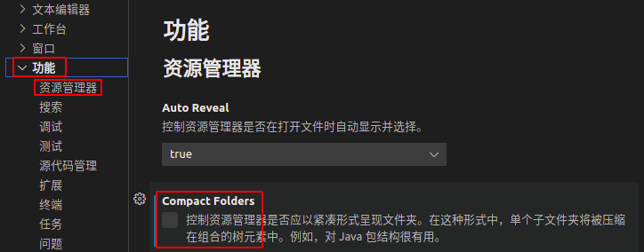

## 下级文件夹与上级文件夹并列的解决

比如我们想在一个文件夹下创建一个子文件夹，但是VScode默认配置下，总会出现如下图所示的下级文件夹总会与上级文件夹并列问题：

甚至会出现如下图所示的情况：

上面的情况并不是我们想要的结果，解决方法如下所示：

按下打开VScode设置的快捷键`Ctrl+，`，打开设置面板，点击`功能`$\to$`资源管理器`，找到`Compact Folders`，将其前面的$\checkmark$去掉即可。

这个时候，资源管理器中的文件就恢复上下级别的关系了：

## 

