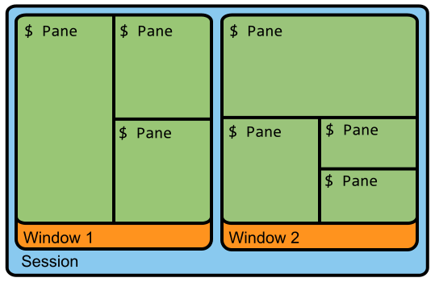

@[TOC](Linux终端复用工具：tmux使用细节（防踩坑）)

## :blue_book: Tmux简介与安装

> 📝 Tmux（Terminal Multiplexer）是一个非常优秀的终端复用器，可以通过开启一个本地或远程主机的终端后，在其中开启多个控制台复用本地或远程主机上的服务。
> 📝 通过tmux可以实现对终端的分屏功能及多任务切换。
> 📝 还可以实现端开终端后，继续后台运行进程。

### :book: Tmux的安装

```bash
# Ubuntu系统
sudo apt update
sudo apt install tmux
```

### :book: 会话与窗口

🔖 <font color="red">会话简介：</font> 通过在终端窗口输入命令，实现用户与计算机进行临时交互的过程称为一次会话。

🔖 <font color="red">窗口简介：</font> 窗口通常与在其中启动的进程是联系在以其的。打开窗口会话开始，关闭窗口会话则结束，相应的会话内部的进程也会终止。

### :book: Tmux界面的主要组成部分

如下图所示，tmux的界面主要由会话（Session）、窗口（Window）和窗格（Pane）组成。Tmux有很多针对这四个组成部分命令操作，只有对它们有了直观了解，将来才能灵活运用tmux的相关命令。

<div align=center></div>

1️⃣ 服务（Server）：通过在终端中输入`tmux`就可以开启一个服务；
2️⃣ 会话（Session）：建立一个tmux工作区会话；
3️⃣ 窗口（Window）：容纳多个窗格；
4️⃣ 面板（Pane）：可以在窗口中分成多个窗格。

👨‍💻 **Tmux运行过程：**
🔖 在终端输入`tmux`即可以打开tmux服务；
🔖 如上图所示，打开tmux服务后，会首先创建一个会话（Session）；
🔖 在这个会话的基础上进而创建窗口；
🔖 在窗口中会创建面板，用于操作系统中相应的服务。

## 📘 tmux的常用操作及其快捷键 

### 📖 会话管理命令及其快捷键

常用的会话管理包括：新建会话、分离会话、列出会话、接入会话、杀死会话、切换会话和重命名会话，具体如下表所示：

| 会话管理 | 命令 | 快捷键 | 描述 |
|:--|:--|:--|:--|
| 新建会话 | `tmux new -s liang` | `` | 新建一个自定义名为`liang`的会话 |
| 分离会话 | `tmux detach` | `d` | 将当前会话与窗口分离 |
| 列出会话 | `tmux ls`或<br>`tmux list-sessions` | `s` | 将当前会话与窗口分离 |
| 接入会话 | `tmux attach -t 0`或<br>`tmux attach -t liang` | `` | 通过会话编号或者名称接入已经存在的会话 |
| 杀死会话 | `tmux kill-session -t 0`或<br>`tmux kill-session -t liang` | `` | 通过会话编号或者名称杀死会话 |
| 重命名会话 | `tmux rename-session -t 0 li` | `` | 将0号会话重命名为`li` |


✨ 注意：不能在一个已经打开的tmux会话中执行新建会话命令，也就是说tmux默认?不支持在一个会话中卡带另一个会话。不然会出现`sessions should be nested with care, unset $TMUX to force`的错误提示。<font color="red">解决方法：</font>直接在新的终端中执行新建会话命令。


<font color="red">注意:</font>在使用下面的快捷键的时候，需要首先使用主键：`Ctrl + b`（也称为激活键），也称为快捷键前缀，然后再按下相应操作的快捷键即可执行相应的操作了。

1、tmux的窗口
| 快捷键 | 描述 |
|:--|:--|
| `c` | 新建窗口 |
| `&` | 关闭窗口 |
| `l` | 切换窗口 |
| `n` | 切换到下一个窗口 |
| `p` | 切换到上一个窗口 |
| `w` | 窗口的菜单列表 |

2、tmux的窗格

| 快捷键 | 描述 |
|:--|:--|
| `"` | 水平分屏 |
| `%` | 垂直分屏 |
| `x` | 关闭窗格 |
| `;` | 切换窗格 |
| `o` | 逆时针切换窗格 |
| `Ctrl + o` | 逆时针转换窗格 |


### :page_with_curl: 三级标题

网址变量为百度官网[^1]
网址变量为CSDN官网[^2]


### :page_with_curl: 三级标题


> **注意：**
> :memo: Tip1
> :memo: Tip2


*:sparkles: 强调1！*
*:dizzy: 强调2！*


:man_technologist: **总结：**


:books:**参考文献**
[^1]: :mag:[百度官网](https://www.baidu.com)
[^2]: :mag:[CSDN官网](https://www.csdn.net)